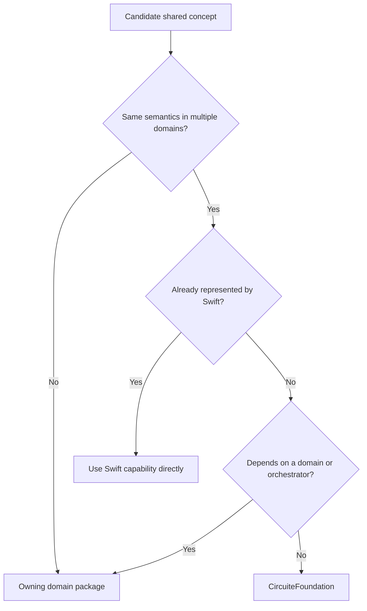

# CircuiteFoundation Design

## Responsibility

`CircuiteFoundation` owns only concepts whose meaning must remain identical across independently distributed
design engines. A type is admitted when all of the following are true:

1. At least two domains exchange the concept with the same semantics.
2. Swift Standard Library or Foundation does not already provide the required semantics.
3. The concept does not depend on an engine, a flow stage, a PDK, or Xcircuite.
4. Its serialized representation can be fixture-tested independently.

## Dependency rule

The package has no package dependencies. Engines may depend on it. It never imports an engine, Xcircuite,
DesignFlowKernel, ToolQualification, or a UI package.

## Engine contract

`Engine` deliberately contains one operation. Request cancellation uses cooperative `Task` cancellation.
Streaming uses `AsyncSequence`. Serialization is required only by consumers that persist requests or outputs.

No universal result envelope is defined. Domain outputs expose cross-domain surfaces by separately conforming to
`ArtifactProducing`, `EvidenceProviding`, and `DiagnosticReporting` when those surfaces exist.

## Trust model

An engine does not certify itself. It emits immutable artifact references, provenance, evidence, and diagnostics.
External qualification, flow policy, and human review determine acceptance.

Artifact identity is separated into two phases:

| Phase | Type | Guarantee |
|---|---|---|
| Before materialization | `ArtifactLocator` | A typed intended location, role, and format |
| After materialization | `ArtifactReference` | A digest and byte count were captured for an immutable file |

`LocalArtifactVerifier` reports missing files and mismatches as structured integrity issues rather than reducing
them to log strings.

## Units

Foundation `Measurement` and available dimensions are used directly. `DatabaseUnitScale` supplies the positive
finite EDA database-unit scale and conversion missing from Foundation, while preserving fractional scales present
in OASIS and other mask formats. Capacitance, inductance, and conductance are dedicated SI
value types because Foundation has no corresponding `Dimension`; this package does not create a parallel unit
framework.

## Explicitly domain-owned

- Netlists, cells, nets, ports, pins, devices, and logic values
- Geometry, layers, placement, routing, and mask algorithms
- PDK rules, corners, models, and process eligibility
- DRC violations, LVS mismatches, timing paths, parasitic networks, and signoff verdicts
- Flow stages, retry policy, approval gates, resume state, and release policy
- UI state and Xcircuite composition
