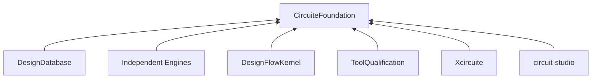
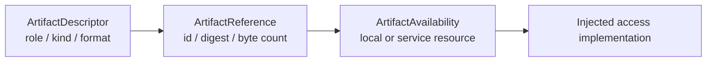

# CircuiteFoundation Design

Status: artifact/evidence values, fixed-width database/revision/entity identity, exact references, schema ranges,
capability negotiation, typed diagnostic subjects, and typed provenance input/output revisions are implemented.
Portable Core/Crypto/FileSystem target separation and location-independent artifact availability are normative
next steps and are not implemented yet.

## Responsibility

`CircuiteFoundation` is the compile-time dependency floor of the LSI workspace. It owns only values and contracts
whose meaning must remain identical across independently usable engines, `DesignDatabase`, external services,
`Xcircuite`, and human-facing applications.

A public type is admitted only when all conditions are true.

1. At least two independent packages exchange the concept with identical semantics.
2. Swift Standard Library or Foundation does not already provide the required semantics.
3. The concept has no dependency on a domain schema, engine algorithm, flow stage, PDK, or workspace runtime.
4. Its serialized representation and invalid-input behavior can be fixture-tested independently.
5. The type is a control-plane value or contract, not a storage or query implementation.


```mermaid
flowchart BT
  Database["DesignDatabase"] --> Core["CircuiteFoundation"]
  Engines["Independent Engines"] --> Core
  Kernel["DesignFlowKernel"] --> Core
  Qualification["ToolQualification"] --> Core
  Runtime["Xcircuite"] --> Core
  Studio["circuit-studio"] --> Core
```

The arrows represent compile-time dependency from consumer to dependency. `CircuiteFoundation` never imports an
LSI workspace package.

## Product and Target Separation

The repository must keep shared types and concrete local implementations separate. The following is the target
layout; the current manifest still has one target linked to `swift-crypto`.

```text
CircuiteFoundation repository
├── CircuiteFoundation
│   └── portable shared values and protocols
├── CircuiteFoundationCrypto
│   └── digest and deterministic identity implementations
└── CircuiteFoundationFileSystem
    └── local artifact materialization and integrity verification
```

| Product | Dependencies | Responsibility |
|---|---|---|
| `CircuiteFoundation` | Swift Standard Library / Foundation only | shared value and protocol contracts |
| `CircuiteFoundationCrypto` | `CircuiteFoundation`, `swift-crypto` | SHA-256 and canonical digest-backed builders |
| `CircuiteFoundationFileSystem` | `CircuiteFoundation` | root-bounded local artifact access and file snapshots |

Domain packages depend directly on `CircuiteFoundation`. They add the implementation products only when they
actually compute digests or access local files. A transitive import is not an acceptable dependency declaration.

This target split resolves the current contradiction where the package documentation says there are no package
dependencies while the single implementation target imports `swift-crypto`.

## Type Families

| Family | Owned values |
|---|---|
| Engine | `Engine`, cross-domain result capability protocols |
| Design identity | database, revision, entity, facet, entity-kind, path, external-object references |
| Compatibility | schema identity, version range, capability requirement and negotiation result |
| Artifact | semantic artifact identity, content integrity, availability and access intent |
| Evidence | invocation, environment fingerprint, execution provenance, evidence manifest |
| Diagnostics | stable code, severity, subject, suggested action |
| Units | database-unit scale and electrical quantities missing from Foundation |

## Design Identity

### Storage and wire representation

| Type | In-memory representation | Canonical encoded representation | Invariant |
|---|---|---|---|
| `DesignDatabaseID` | two `UInt64` words | 32 lowercase hexadecimal digits | never all zero |
| `DesignRevisionID` | two `UInt64` words | 32 lowercase hexadecimal digits | scoped by `DesignDatabaseID` |
| `DesignEntityID` | `UInt64` | 16 lowercase hexadecimal digits | nonzero and never reused within one database |
| `DesignFacetID` | validated ASCII token | string | open, namespaced, control-plane only |
| `DesignEntityKindID` | validated ASCII token | string | interpreted by the owning facet |

Fixed-width integers are encoded as hexadecimal strings because JSON numbers cannot preserve every `UInt64` in
all external clients. Random or deterministic ID generation is an injected implementation responsibility; the
value types only validate and carry identity.

### Reference types

| Type | Fields | Meaning |
|---|---|---|
| `DesignRevisionReference` | database ID + revision ID | one exact immutable revision |
| `DesignEntityKey` | database ID + entity ID | one logical entity across revisions |
| `DesignEntityReference` | revision reference + facet ID + entity-kind ID + entity ID | one entity as observed in one exact revision |
| `DesignPathReference` | facet ID + entity-kind ID + hierarchy path + local identifier | human, parser, or diagnostic addressing before a DB identity exists |
| `ExternalObjectReference` | system ID + source scope digest + object kind + opaque identifier | scoped identity owned by OpenDB or another external system |
| `DesignSubjectReference` | tagged entity / path / external case | diagnostic subject without collapsing different identity semantics |

`DesignEntityKey` does not prove that the entity exists in every revision. `DesignEntityReference` is exact and
must fail resolution when the database, revision, facet, kind, or entity does not match.

The removed `DesignObjectReference` conflated path addressing with persistent identity. The completed breaking
migration replaces it with `DesignPathReference`, `DesignEntityReference`, and `DesignSubjectReference`.

## Schema and Capability Contract

`SchemaVersion` remains an ordered semantic version. Exact equality is not a compatibility policy.

| Type | Responsibility |
|---|---|
| `SchemaVersionRange` | inclusive lower bound and exclusive upper bound |
| `DesignSchemaID` | globally namespaced schema token |
| `DesignSchemaDescriptor` | schema ID, facet ID, version, canonical schema digest, required schemas |
| `DesignCapabilityID` | globally namespaced open capability token |
| `DesignCapabilityDescriptor` | capability ID and supported version range |
| `DesignCapabilityRequirement` | required or optional capability range |
| `DesignCompatibilityReport` | agreed schemas / capabilities, missing requirements, incompatible versions, limitations |

Compatibility succeeds only when every required schema and capability has a nonempty version intersection.
Unknown optional capabilities are retained as limitations. Unknown required capabilities and invalid schema
digests are typed failures; callers must not silently downgrade.

Schema descriptors describe contracts. They do not contain storage layout, table allocation, index instances, or
domain validation algorithms.

## Artifact Contract

Artifact content identity and artifact availability are separate.


```mermaid
flowchart LR
  Descriptor["ArtifactDescriptor\nrole / kind / format"] --> Reference["ArtifactReference\nid / digest / byte count"]
  Reference --> Availability["ArtifactAvailability\nlocal or service resource"]
  Availability --> Access["Injected access implementation"]
```

| Type | Responsibility |
|---|---|
| `ArtifactDescriptor` | semantic role, kind, format |
| `ArtifactReference` | stable artifact ID, descriptor, digest, byte count, producer |
| `ArtifactLocation` | validated local materialization location |
| `ArtifactResourceReference` | service namespace and opaque resource identity; no credentials |
| `ArtifactAvailability` | tagged local-location or service-resource availability |
| `ArtifactAccessIntent` | desired access and expected immutable reference before materialization |

`ArtifactReference` must not derive identity from a file path. The same immutable content can be available at
multiple locations without becoming a different artifact. URLs containing credentials, raw environment variables,
and service secrets are never serialized into Foundation values.

`SHA256ContentDigester` and deterministic artifact / evidence builders move to `CircuiteFoundationCrypto`.
`LocalArtifactReferencer` and `LocalArtifactVerifier` move to `CircuiteFoundationFileSystem` and receive digest
services through protocols.

## Evidence and Provenance

`ExecutionProvenance` records facts and never grants qualification or approval.

The breaking revision contract replaces one ambiguous `designRevision: ContentDigest?` field with:

| Field | Meaning |
|---|---|
| `inputDesignRevision: DesignRevisionReference?` | exact revision read by the execution |
| `outputDesignRevision: DesignRevisionReference?` | exact candidate revision produced by the execution |
| `configurationDigest: ContentDigest?` | canonical configuration bytes |
| `inputs: [ArtifactReference]` | immutable non-database inputs |
| `producer` / `supportingTools` | executable and supporting implementation identities |
| `invocation` / `environment` | sanitized reproducibility facts |
| `randomSeed` | replay seed when randomness exists |
| `startedAt` / `completedAt` | finite ordered timestamps |

The revision manifest owns the database state digest. A raw digest is not accepted where a scoped revision
reference is required.

`EvidenceManifest` remains a value. Content-derived ID construction and canonical hashing belong to the Crypto
implementation product so that the Core target does not import a crypto implementation.

## Diagnostics

`DesignDiagnostic.subject` uses `DesignSubjectReference?`.

- use an exact entity reference when the database revision is known;
- use a path reference for parser, import, and pre-database failures;
- use an external reference when reporting an OpenDB or tool-owned object;
- never convert an unresolved external or path subject into a fake entity ID.

Diagnostic summary and detail are human-readable. Diagnostic code, severity, subject, and suggested actions are
the machine-readable contract.

## Engine Contract

`Engine` deliberately contains one operation. Request cancellation uses cooperative `Task` cancellation.
Streaming uses `AsyncSequence`. Serialization is required only by consumers that persist requests or outputs.

No universal result envelope is defined. Domain outputs expose cross-domain surfaces by separately conforming to
`ArtifactProducing`, `EvidenceProviding`, and `DiagnosticReporting` when those surfaces exist.

Database access protocols are not added to `CircuiteFoundation`; they belong to `DesignDatabaseCore`.

## Units

Foundation `Measurement` and available dimensions are used directly. `DatabaseUnitScale` supplies a positive
finite EDA database-unit scale and explicit integer conversion. Capacitance, inductance, and conductance remain
dedicated SI values because Foundation has no equivalent `Dimension`.

Geometry, coordinate vectors, rectangles, layers, transformations, wavelength models, optical modes, and process
rules remain domain-owned.

## Serialization Rules

- Persistent values use explicit coding keys.
- Token strings are ASCII, nonempty, trimmed, control-character-free, and length-bounded.
- Fixed-width IDs use canonical lowercase hexadecimal strings.
- Decoder validation is identical to initializer validation.
- Unknown enum cases are not rounded to a default.
- Compatibility is decided by schema / capability negotiation, not by fallback decoding.
- Canonical hashing uses a specified field order and binary encoding, never reflection or default JSON ordering.
- Large data-plane batches and database pages are not represented by Foundation `Codable` values.

## Concurrency and Performance

Foundation values are immutable `Sendable` values. The Core target contains no shared mutable state, actor,
mutex, file I/O, or database page ownership.

Control-plane identity and diagnostics may use strings and arrays. Database hot paths must not materialize
`DesignEntityReference`, `HierarchyPath`, JSON, or artifact values for every object traversal. `DesignDatabase`
maps stable identities to revision-scoped compact handles and borrowed column views.

## Explicitly Domain-Owned

- Netlists, cells, nets, ports, pins, devices, buses, logic values, and power intent
- Geometry, layers, placement, routing, waveguides, optical modes, and mask algorithms
- PDK rules, corners, models, and process eligibility
- DRC violations, LVS mismatches, timing paths, parasitic networks, and signoff verdicts
- Flow stages, retry policy, approval gates, resume state, and release policy
- Database transaction implementation, page storage, indexes, WAL, checkpoint, and service sessions
- OpenDB object model and OpenROAD algorithms
- UI state and Xcircuite composition

## Breaking Migration Map

| Removed surface | Implemented replacement |
|---|---|
| `DesignObjectReference` | `DesignPathReference` / `DesignEntityReference` / `DesignSubjectReference` |
| `ExecutionProvenance.designRevision` | input and output `DesignRevisionReference` fields |
| `ArtifactReference.locator` | content-only `ArtifactReference` plus separate `ArtifactAvailability` |
| `ArtifactID(stableKey:)` | injected deterministic ID builder in `CircuiteFoundationCrypto` |
| Core `SHA256ContentDigester` | `CircuiteFoundationCrypto` |
| Core local file implementations | `CircuiteFoundationFileSystem` |
| exact-only schema checks | `SchemaVersionRange` and compatibility reports |
| domain `Int` schema versions | domain migration to shared `SchemaVersion` contracts |

There is no compatibility shim. Consumer packages migrate in one coordinated breaking change and tests must prove
success, invalid-input, unavailable-resource, and incompatible-schema behavior.
