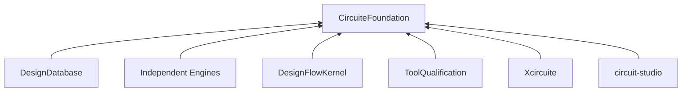
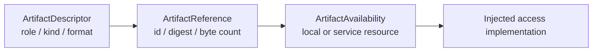

# CircuiteFoundation Design

Status: artifact/evidence values, fixed-width database/revision/entity identity, exact references, schema ranges,
capability negotiation, typed diagnostic subjects, typed provenance revisions, the portable
Core/Foundation-bridge/Crypto/FileSystem target split, scoped digest contract, secure root-relative file access,
and location-independent artifact availability are implemented. Concrete serialization conformances are isolated
from Core in a host adapter target. Core runs with identical canonical output on Native, WASI, and Embedded WASM;
the separate implementation products retain their own supported or explicitly unsupported matrix cells.
`PORTABILITY_MATRIX.md` is the observed evidence ledger.

## Responsibility

`CircuiteFoundation` is the compile-time dependency floor of the LSI workspace. It owns only values and contracts
whose meaning must remain identical across independently usable engines, `DesignDatabase`, external services,
`Xcircuite`, and human-facing applications.

A public type is admitted only when all conditions are true.

1. At least two independent packages exchange the concept with identical semantics.
2. Swift Standard Library or Foundation does not already provide the required semantics.
3. The concept has no dependency on a domain schema, engine algorithm, flow stage, PDK, or workspace runtime.
4. Its serialized representation and invalid-input behavior can be fixture-tested independently.
5. The type is a control-plane value or contract, not a storage or query implementation.


```mermaid
flowchart BT
  Database["DesignDatabase"] --> Core["CircuiteFoundation"]
  Engines["Independent Engines"] --> Core
  Kernel["DesignFlowKernel"] --> Core
  Qualification["ToolQualification"] --> Core
  Runtime["Xcircuite"] --> Core
  Studio["circuit-studio"] --> Core
```

The arrows represent compile-time dependency from consumer to dependency. `CircuiteFoundation` never imports an
LSI workspace package.

## Product and Target Separation

The repository keeps shared types and concrete local implementations in the following target layout.

```text
CircuiteFoundation repository
├── CircuiteFoundation
│   └── Standard-Library-only portable shared values and protocols
├── CircuiteFoundationSerialization
│   └── internal explicit Codable adapters that revalidate Core values
├── CircuiteFoundationFoundation
│   └── re-exported serialization plus Foundation URL, Date, UUID, Measurement, and LocalizedError bridges
├── CircuiteFoundationCrypto
│   └── digest and deterministic identity implementations
└── CircuiteFoundationFileSystem
    └── local artifact materialization and integrity verification
```

| Product | Dependencies | Responsibility |
|---|---|---|
| `CircuiteFoundation` | Swift Standard Library only | shared value and protocol contracts with identical Native/WASM/Embedded semantics |
| `CircuiteFoundationFoundation` | `CircuiteFoundation`, internal serialization adapter, Foundation | optional host serialization and conversions; no canonical identity, I/O, or mutable state |
| `CircuiteFoundationCrypto` | `CircuiteFoundation`; `swift-crypto` only for selected host platforms | SHA-256 when a qualified backend is linked, otherwise typed backend unavailability |
| `CircuiteFoundationFileSystem` | `CircuiteFoundation`, host filesystem APIs | root-capability-bounded local artifact access and immutable file snapshots |

Domain packages depend directly on `CircuiteFoundation`. They add the implementation products only when they
actually compute digests or access local files. A transitive import is not an acceptable dependency declaration.

This target split keeps `swift-crypto` in qualified host compositions of the Crypto implementation product and
out of the Core dependency floor and pinned WASI compositions.

The Core target cannot import `URL`, `Date`, `UUID`, `Measurement`, `FileHandle`, or `LocalizedError`. Canonical
timestamps, fixed-width IDs, scalar units, relative path segments, and structured errors remain Core values.
`CircuiteFoundationFoundation` adds loss-checked conversions without changing their wire meaning. Random ID
generation is also an injected implementation concern; Core validates and carries generated values.

| Product | macOS Native | WASI WASM | Embedded WASM |
|---|---|---|---|
| `CircuiteFoundation` | required compile/link/runtime fixtures | required compile/link/runtime fixtures | required compile/link/runtime fixtures |
| `CircuiteFoundationFoundation` | runtime verified | runtime verified | compile-time unavailable; not part of the Embedded contract |
| `CircuiteFoundationCrypto` | SHA-256 runtime verified | runtime verified typed unsupported | runtime verified typed unsupported |
| `CircuiteFoundationFileSystem` | descriptor-relative security corpus verified | compile-time unavailable; no Darwin adapter | compile-time unavailable; not part of the Embedded contract |

Unsupported implementation products are absent from composition; Core never substitutes a weaker implementation.
Every supported cell is compiled and linked with the exact pinned toolchain/SDK. Runtime behavior is required where
the target is executable; compile success alone is not portability evidence.

## Type Families

| Family | Owned values |
|---|---|
| Engine | `Engine`, cross-domain result capability protocols |
| Design identity | database, revision, entity, authorization subject scope, facet, entity-kind, path, external-object references |
| Compatibility | schema identity, version range, capability requirement and negotiation result |
| Artifact | semantic artifact identity, content integrity, availability and access intent |
| Evidence | invocation, environment fingerprint, execution provenance, evidence manifest |
| Diagnostics | stable code, severity, subject, suggested action |
| Units | database-unit scale and electrical quantities missing from Foundation |

## Design Identity

### Storage and wire representation

| Type | In-memory representation | Canonical encoded representation | Invariant |
|---|---|---|---|
| `DesignDatabaseID` | two `UInt64` words | 32 lowercase hexadecimal digits | never all zero |
| `DesignRevisionID` | two `UInt64` words | 32 lowercase hexadecimal digits | scoped by `DesignDatabaseID` |
| `DesignAuthorizationSubjectScopeID` | two `UInt64` words | 32 lowercase hexadecimal digits | nonzero opaque authorization-domain scope; grants no authority |
| `DesignEntityID` | `UInt64` | 16 lowercase hexadecimal digits | nonzero and never reused within one database |
| `DesignFacetID` | validated ASCII token | string | open, namespaced, control-plane only |
| `DesignEntityKindID` | validated ASCII token | string | interpreted by the owning facet |

Fixed-width integers are encoded as hexadecimal strings because JSON numbers cannot preserve every `UInt64` in
all external clients. Random or deterministic ID generation is an injected implementation responsibility; the
value types only validate and carry identity.

`DesignAuthorizationSubjectScopeID` lets DesignDatabase, Xcircuite, and a remote service
name the same non-secret operation namespace without importing authentication policy.
The authenticated host/service owns stable principal-to-scope mapping and handle
binding. The value is not derived directly from identifying plaintext, and possessing
or constructing it never grants access.

### Reference types

| Type | Fields | Meaning |
|---|---|---|
| `DesignRevisionReference` | database ID + revision ID | one exact immutable revision |
| `DesignEntityKey` | database ID + entity ID | one logical entity across revisions |
| `DesignEntityReference` | revision reference + facet ID + entity-kind ID + entity ID | one entity as observed in one exact revision |
| `DesignPathReference` | facet ID + entity-kind ID + hierarchy path + local identifier | human, parser, or diagnostic addressing before a DB identity exists |
| `ExternalObjectReference` | system ID + source scope digest + object kind + opaque identifier | scoped identity owned by OpenDB or another external system |
| `DesignSubjectReference` | tagged entity / path / external case | diagnostic subject without collapsing different identity semantics |

`DesignEntityKey` does not prove that the entity exists in every revision. `DesignEntityReference` is exact and
must fail resolution when the database, revision, facet, kind, or entity does not match.

The removed `DesignObjectReference` conflated path addressing with persistent identity. The completed breaking
migration replaces it with `DesignPathReference`, `DesignEntityReference`, and `DesignSubjectReference`.

## Schema and Capability Contract

`SchemaVersion` remains an ordered semantic version. Exact equality is not a compatibility policy.

| Type | Responsibility |
|---|---|
| `SchemaVersionRange` | inclusive lower bound and exclusive upper bound |
| `DesignSchemaID` | globally namespaced schema token |
| `DesignSchemaDescriptor` | schema ID, facet ID, version, canonical schema digest, required schemas |
| `DesignCapabilityID` | globally namespaced open capability token |
| `DesignCapabilityDescriptor` | capability ID and supported version range |
| `DesignCapabilityRequirement` | required or optional capability range |
| `DesignCompatibilityReport` | agreed schemas / capabilities, missing requirements, incompatible versions, limitations |

Compatibility succeeds only when every required schema and capability has a nonempty version intersection.
Unknown optional capabilities are retained as limitations. Unknown required capabilities and invalid schema
digests are typed failures; callers must not silently downgrade.

Schema descriptors describe contracts. They do not contain storage layout, table allocation, index instances, or
domain validation algorithms.

## Artifact Contract

Artifact content identity and artifact availability are separate.


```mermaid
flowchart LR
  Descriptor["ArtifactDescriptor\nrole / kind / format"] --> Reference["ArtifactReference\nid / digest / byte count"]
  Reference --> Availability["ArtifactAvailability\nlocal or service resource"]
  Availability --> Access["Injected access implementation"]
```

| Type | Required fields and responsibility |
|---|---|
| `ArtifactDescriptor` | validated role, kind, and format tokens; semantic use only |
| `ArtifactID` | algorithm-qualified content digest plus exact byte count; immutable content identity |
| `ArtifactReference` | `ArtifactID` plus descriptor; no path, producer, service, or credential |
| `ArtifactRootID` | logical root identity selected by composition; never a host path |
| `ArtifactRelativePath` | nonempty validated path-segment sequence below one root |
| `ArtifactResourceReference` | service ID, namespace ID, opaque resource ID, immutable generation; no credentials |
| `ArtifactAvailability` | tagged local `(rootID, relativePath)` or service-resource availability, bound to one `ArtifactID` |
| `ArtifactAccessIntent` | expected complete reference, selected availability, operation, nonzero byte/page/work limits |

`ArtifactReference` must not derive identity from a file path. The same immutable content can be available at
multiple locations without becoming a different artifact. URLs containing credentials, raw environment variables,
and service secrets are never serialized into Foundation values.

`ArtifactID` is not producer-assigned. Its canonical version-one encoding is the ASCII domain
`CircuiteArtifactContent` plus one NUL byte, unsigned 16-bit big-endian version one, the canonical digest-algorithm
token, digest-byte length and digest bytes, and unsigned 64-bit big-endian byte count. `ArtifactReference` contains
that ID and a descriptor, not a second independently mutable digest/count pair. Producer identity belongs to
`ExecutionProvenance`; an external producer token belongs to `ArtifactResourceReference`. Decoder validation
therefore proves the ID/digest/count binding without constructing a crypto implementation, and no arbitrary
`ArtifactID(stableKey:)` or caller-supplied identity bypass exists.

Role, kind, format, root, service, namespace, and resource tokens use the Core token codec: unsigned 16-bit
big-endian UTF-8 byte length followed by nonempty canonical token bytes. Relative paths encode a nonzero unsigned
16-bit segment count followed by individually length-prefixed segments. Empty segments, `.`, `..`, absolute
prefixes, separators inside a segment, NUL/control bytes, and noncanonical decoding are rejected. Availability is
encoded with a fixed version and explicit local/service tag; an unknown tag fails instead of defaulting.

The injected `ArtifactAccessing` protocol consumes `ArtifactAccessIntent` and opens an access session. A session is
bound to one expected `ArtifactReference`, one availability, one immutable resource generation, and one admitted
budget. It returns bounded owner-backed byte pages with exact offset, cumulative bytes/work, and completion
evidence, and exposes asynchronous close/termination. It never returns a host path, credential, or unscoped
storage handle. The final receipt proves the observed `ArtifactID`; mismatch, resource change, truncation, budget
exhaustion, unsupported capability, read failure, and close failure are distinct typed outcomes. Local and service
implementations share this Core protocol, while transport, authentication, retry, and root handles remain in their
implementation products.

```swift
public protocol ArtifactAccessing: Sendable {
    func open(
        _ intent: ArtifactAccessIntent
    ) async throws(ArtifactAccessError) -> any ArtifactReadSession
}

public protocol ArtifactReadSession: AnyObject, Sendable {
    var identity: ArtifactAccessSessionIdentity { get }
    var expectedReference: ArtifactReference { get }

    func readPage(
        _ request: ArtifactReadPageRequest
    ) async throws(ArtifactAccessError) -> ArtifactReadPage

    func close() async -> any ArtifactAccessTermination
}

public protocol ArtifactOwnedBytes: Sendable {
    var byteCount: UInt64 { get }

    func withUnsafeBytes<Result>(
        _ body: (UnsafeRawBufferPointer) throws -> Result
    ) rethrows -> Result
}

public struct ArtifactReadPage: Sendable {
    public let offset: UInt64
    public let bytes: any ArtifactOwnedBytes
    public let cumulativeByteCount: UInt64
    public let cumulativeWork: ArtifactAccessWorkReport
    public let completion: ArtifactReadCompletion
    public let finalReceipt: ArtifactAccessReceipt?
}
```

Requests bind a nonzero page size and whole-session byte/work/deadline budget. Page offsets are contiguous and
checked; completion and a verified final receipt appear together exactly on the terminal page. `close()` is
idempotent and returns a stable termination object whose wait can report local/service cleanup failure. Unsafe bytes
are closure-scoped and the page owner remains retained for the callback.

`SHA256ContentDigester` and deterministic artifact / evidence builders move to `CircuiteFoundationCrypto`.
`LocalArtifactReferencer` and `LocalArtifactVerifier` move to `CircuiteFoundationFileSystem` and receive digest
services through protocols.

`ContentDigesting` remains a portable Core protocol because independently usable packages must exchange the same
algorithm-qualified digest contract. Its P0 replacement creates a single-owner incremental in-memory digest
session with checked update/finalize state; it has no path, URL, `FileHandle`, or file-opening requirement.
Consumers that create canonical state, including `DesignDatabaseCore` plan builders and
`DesignDatabaseRuntime`, receive this protocol by injection. A host composition explicitly adds
`CircuiteFoundationCrypto` and supplies the SHA-256 session implementation; Core consumers do not construct a
concrete digester or acquire Crypto transitively. Large payloads are hashed as bounded updates, never by
concatenating an entire design into one `Data` value.

The exact public P0 shape is closure-scoped and existential-safe:

```swift
public protocol ContentDigesting: Sendable {
    func digest(
        using algorithm: ContentDigestAlgorithm,
        limits: ContentDigestSessionLimits,
        _ body: (borrowing ContentDigestUpdateLease) throws(ContentDigestError) -> Void
    ) throws(ContentDigestError) -> ContentDigestResult
}

public struct ContentDigestUpdateLease: ~Copyable {
    public borrowing func update(
        _ bytes: borrowing [UInt8]
    ) throws(ContentDigestError)
}

public struct ContentDigestSessionLimits: Sendable, Hashable {
    public let maximumChunkByteCount: UInt64
    public let maximumTotalByteCount: UInt64
    public let maximumUpdateCount: UInt64
}

public struct ContentDigestResult: Sendable, Hashable {
    public let digest: ContentDigest
    public let totalByteCount: UInt64
    public let updateCount: UInt64
}
```

All three limits are nonzero. `update` rejects a chunk before backend mutation when a chunk, cumulative byte, update
count, or integer-overflow bound would be exceeded. The closure is synchronous and nonescaping; the noncopyable,
non-`Sendable` lease cannot be retained, copied, finalized, shared with another task, or used after the call.
`digest` creates one internal backend session, invokes the body, finalizes exactly once only after successful body
return, and returns only the finalized result. Body/update failure aborts and invalidates the backend and returns no
digest. Typed failures distinguish invalid limits, unsupported algorithm, chunk/total/update limit, byte-count
overflow, use-after-scope/internal state violation, backend update failure, finalization failure, and abort failure;
an abort failure is retained with the primary failure rather than replacing or suppressing it.

The Core target defines a package-scoped reference-semantic `ContentDigestSessionBackend` bridge used only by
implementation products. `CircuiteFoundationCrypto` constructs that backend and the public lease privately wraps
it. A Core consumer sees only `any ContentDigesting` and the scoped lease, so no associated type, concrete crypto
state, or finalization authority crosses the existential boundary. Domain canonicalization failures are resolved
before entering the digest body; the body can fail only with the declared digest/session errors.

File opening, root/path validation, chunked reads, and streamed file hashing belong to
`CircuiteFoundationFileSystem`, which receives the Core digester. The current single-target `ContentDigesting`
combines `Data` and file-URL methods, so CF-DB-6 cannot satisfy its responsibility boundary without the P0
CF-DB-10 protocol split. CF-DB-11 separately tracks optional borrowed-span/zero-copy optimization after the safe
bounded session is benchmarked; that optimization is not allowed to delay the responsibility fix.

| Target contract | Owner | Invariant |
|---|---|---|
| `ContentDigesting` | Core | immutable `Sendable` existential-safe factory contract; owns create/finalize/abort and has no file/path API |
| `ContentDigestUpdateLease` | Core | noncopyable closure-scoped update authority; never exposes finalize or backend state |
| SHA-256 digester/session | Crypto | implements the Core algorithm/session contract and canonical vectors |
| root/read capability | FileSystem | opens one exact descriptor below an owned root, streams bounded reads into an injected Core session, and reports stat/read/change/close failures |

This spelling is the design contract; compiling it under the pinned Swift 6.4 baseline is implementation evidence,
not a deferred API decision. The safe P0 boundary uses bounded caller-owned `[UInt8]` values and does not promise
zero allocation. Borrowed `Span` updates are admitted only in CF-DB-11 with lifetime and allocation/copy evidence;
an unsafe pointer cannot escape the update call.

### Secure local filesystem capability

`CircuiteFoundationFileSystem` opens a root directory once and creates a runtime-only
`ArtifactRootCapability`. The capability and every `ArtifactReadLease` are non-`Codable`; serialized Core values
carry only `ArtifactRootID` and `ArtifactRelativePath`.


```mermaid
flowchart LR
  Config["Host root configuration"] --> Root["Owned root-directory handle"]
  Root --> Traverse["Component-at-a-time no-follow traversal"]
  Traverse --> Lease["One exact read-only file handle"]
  Lease --> Before["fstat before"]
  Before --> Hash["Bounded read + injected digest session"]
  Hash --> After["fstat after on same handle"]
  After --> Receipt["Identity / size / change-token match receipt"]
  Receipt --> Close["Fallible exactly-once close"]
```

Traversal uses descriptor-relative `openat`-equivalent operations, rejects symlinks for every component, and never
validates a path and then reopens it by URL. The final component must be a regular file. The read lease owns that
exact handle; pre-read and post-read metadata are obtained from the same handle and bind stable file identity,
size, and the strongest available change token. A changed identity/size/token, short read, or digest mismatch is a
failure and no reference is published.

`ArtifactRootCapability.close()` first closes admission, drains issued read leases, closes the root descriptor, and
returns a termination handle whose awaited result can report drain/descriptor-close failure. Each read operation
also performs fallible exactly-once handle close on success, error, and cancellation. External callbacks and digest
finalization run outside capability-state critical sections. Typed errors distinguish invalid root, invalid
relative path, symlink/reparse traversal, escape, non-regular target, open/stat/read/change/digest failure, budget
exhaustion, cancellation, file-close failure, root-close failure, and unsupported secure traversal. A platform
without equivalent root-relative no-follow semantics cannot compose this product; it must not fall back to string
prefix checks or resolve-then-reopen behavior.

## Evidence and Provenance

`ExecutionProvenance` records facts and never grants qualification or approval.

The breaking revision contract replaces one ambiguous `designRevision: ContentDigest?` field with:

| Field | Meaning |
|---|---|
| `inputDesignRevision: DesignRevisionReference?` | exact revision read by the execution |
| `outputDesignRevision: DesignRevisionReference?` | exact candidate revision produced by the execution |
| `configurationDigest: ContentDigest?` | canonical configuration bytes |
| `inputs: [ArtifactReference]` | immutable non-database inputs |
| `producer` / `supportingTools` | executable and supporting implementation identities |
| `invocation` / `environment` | sanitized reproducibility facts |
| `randomSeed` | replay seed when randomness exists |
| `startedAt` / `completedAt` | finite ordered timestamps |

The revision manifest owns the database state digest. A raw digest is not accepted where a scoped revision
reference is required.

`EvidenceManifest` remains a value. Content-derived ID construction and canonical hashing belong to the Crypto
implementation product so that the Core target does not import a crypto implementation.

## Diagnostics

`DesignDiagnostic.subject` uses `DesignSubjectReference?`.

- use an exact entity reference when the database revision is known;
- use a path reference for parser, import, and pre-database failures;
- use an external reference when reporting an OpenDB or tool-owned object;
- never convert an unresolved external or path subject into a fake entity ID.

Diagnostic summary and detail are human-readable. Diagnostic code, severity, subject, and suggested actions are
the machine-readable contract.

## Engine Contract

`Engine` deliberately contains one operation. Request cancellation uses cooperative `Task` cancellation.
Streaming uses `AsyncSequence`. Serialization is required only by consumers that persist requests or outputs.

No universal result envelope is defined. Domain outputs expose cross-domain surfaces by separately conforming to
`ArtifactProducing`, `EvidenceProviding`, and `DiagnosticReporting` when those surfaces exist.

Database access protocols are not added to `CircuiteFoundation`; they belong to `DesignDatabaseCore`.

## Units

Foundation `Measurement` and available dimensions are used directly. `DatabaseUnitScale` supplies a positive
finite EDA database-unit scale and explicit integer conversion. Capacitance, inductance, and conductance remain
dedicated SI values because Foundation has no equivalent `Dimension`.

Geometry, coordinate vectors, rectangles, layers, transformations, wavelength models, optical modes, and process
rules remain domain-owned.

## Serialization Rules

- Persistent values use explicit coding keys.
- Token strings are ASCII, nonempty, trimmed, control-character-free, and length-bounded.
- Fixed-width IDs use canonical lowercase hexadecimal strings.
- Decoder validation is identical to initializer validation.
- Unknown enum cases are not rounded to a default.
- Compatibility is decided by schema / capability negotiation, not by fallback decoding.
- Canonical hashing uses a specified field order and binary encoding, never reflection or default JSON ordering.
- Large data-plane batches and database pages are not represented by Foundation `Codable` values.

## Concurrency and Performance

Foundation values are immutable `Sendable` values. The Core target contains no shared mutable state, actor,
mutex, file I/O, or database page ownership.

Control-plane identity and diagnostics may use strings and arrays. Database hot paths must not materialize
`DesignEntityReference`, `HierarchyPath`, JSON, or artifact values for every object traversal. `DesignDatabase`
maps stable identities to revision-scoped compact handles and borrowed column views.

## Explicitly Outside CircuiteFoundation

- Netlists, cells, nets, ports, pins, devices, buses, logic values, and power intent
- Geometry, layers, placement, routing, waveguides, optical modes, and mask algorithms
- PDK rules, corners, models, and process eligibility
- DRC violations, LVS mismatches, timing paths, parasitic networks, and signoff verdicts
- Flow stages, retry policy, approval gates, resume state, and release policy
- Database transaction implementation, page storage, indexes, WAL, checkpoint, and service sessions
- OpenDB object model and OpenROAD algorithms
- UI state and Xcircuite composition

## Breaking Migration Map

| Removed surface | Target replacement | Status |
|---|---|---|
| `DesignObjectReference` | `DesignPathReference` / `DesignEntityReference` / `DesignSubjectReference` | Source migration complete; workspace consumer build matrix remains |
| `ExecutionProvenance.designRevision` | input and output `DesignRevisionReference` fields | Source migration complete; workspace consumer build matrix remains |
| `ArtifactReference.locator` | content-only `ArtifactReference` plus separate `ArtifactAvailability` | Source migration complete; workspace consumer build matrix remains |
| arbitrary / producer-assigned `ArtifactID` and `ArtifactID(stableKey:)` | exact `ArtifactID(contentDigest, byteCount)` Core value | Source migration complete; workspace consumer build matrix remains |
| Core `SHA256ContentDigester` | `CircuiteFoundationCrypto` | Product split complete |
| Core local file implementations | `CircuiteFoundationFileSystem` | Product split complete |
| Foundation-specific Core conversions and serialization | optional `CircuiteFoundationFoundation` bridge | Product split complete; workspace consumer build matrix remains |
| exact-only schema checks | `SchemaVersionRange` and compatibility reports | Source migration complete; workspace consumer build matrix remains |
| domain `Int` schema versions | domain migration to shared `SchemaVersion` contracts | Consumer migration remains |

There is no compatibility shim. Consumer packages migrate in one coordinated breaking change and tests must prove
success, invalid-input, unavailable-resource, and incompatible-schema behavior.
