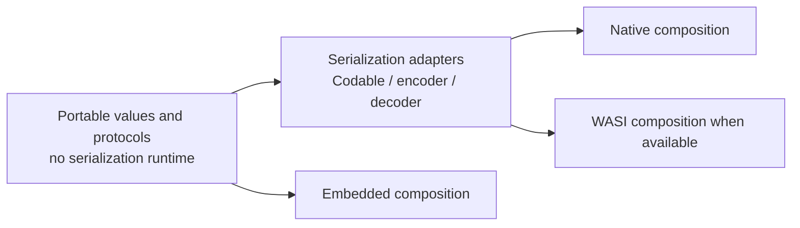

# CircuiteFoundation Portability Matrix

Recorded: 2026-08-11

This document records observed compile, link, and runtime behavior. It does not infer
support from declarations or from a successful host build.

## Fixed environment

| Field | Value |
|---|---|
| Swift | `Apple Swift version 6.4-dev` |
| Swift compiler commit | `ef761e567dc94ee` |
| LLVM commit | `264fd65923c28d9` |
| Native target | `arm64-apple-macosx27.0.0` |
| macOS | `27.0 (26A5388g)` |
| WASI SDK | `swift-6.4.x-DEVELOPMENT-SNAPSHOT-2026-07-23-a_wasm` |
| Embedded WASM SDK | `swift-6.4.x-DEVELOPMENT-SNAPSHOT-2026-07-23-a_wasm-embedded` |

## Core probe

The shared probe support imports only `CircuiteFoundation`. The Native/WASI executable and
the Embedded executable call the same support function. The probe validates canonical
database, subject-scope, and revision encodings plus deterministic schema and capability
negotiation. All three executions produced the same exact output:

```text
CircuiteFoundationPortabilityProbe:00000000000000010000000000000002:00000000000000030000000000000004:00000000000000050000000000000006:query.exact-revision
```

| Profile | Compile | Link | Runtime | Observed result |
|---|---:|---:|---:|---|
| Native | Pass | Pass | Pass | Probe completed with the canonical output above |
| WASI WASM | Pass | Pass | Pass | Probe completed with byte-identical canonical output |
| Embedded WASM | Pass | Pass | Pass | Core contains no serialization protocol references; the Embedded executable links the pinned SDK's `swiftUnicodeDataTables` support library and produced byte-identical canonical output |

Commands used:

```bash
swift build --build-tests -j 4
swift run CircuiteFoundationPortabilityProbe
swift run --swift-sdk swift-6.4.x-DEVELOPMENT-SNAPSHOT-2026-07-23-a_wasm CircuiteFoundationPortabilityProbe
swift run --swift-sdk swift-6.4.x-DEVELOPMENT-SNAPSHOT-2026-07-23-a_wasm-embedded CircuiteFoundationEmbeddedPortabilityProbe
```

## Host serialization adapter probe

The serialization probe imports `CircuiteFoundationFoundation`, encodes a database identity
through the explicit Codable adapter, decodes it through the validated Core initializer, and
checks the canonical single-string representation. Native and WASI produced the same output:

```text
CircuiteFoundationSerializationPortabilityProbe:00000000000000010000000000000002
```

| Profile | Compile | Link | Runtime | Observed result |
|---|---:|---:|---:|---|
| Native | Pass | Pass | Pass | Canonical JSON encode and validated decode completed |
| WASI WASM | Pass | Pass | Pass | Byte-identical canonical round trip |
| Embedded WASM | Fail | Not run | Not run | `Codable`, `CodingKey`, `Encoder`, and `Decoder` are explicitly unavailable in the pinned Embedded standard library; this host adapter is outside the Embedded composition |

Commands used:

```bash
swift run CircuiteFoundationSerializationPortabilityProbe
swift run --swift-sdk swift-6.4.x-DEVELOPMENT-SNAPSHOT-2026-07-23-a_wasm CircuiteFoundationSerializationPortabilityProbe
swift run --swift-sdk swift-6.4.x-DEVELOPMENT-SNAPSHOT-2026-07-23-a_wasm-embedded CircuiteFoundationSerializationPortabilityProbe
```

## Crypto backend probe

The Crypto probe requests one bounded incremental SHA-256 digest over `abc`. Native produced
the standard SHA-256 vector. The pinned WASI profiles do not link `swift-crypto`: the previously
observed WASI generic-metadata runtime trap is now closed by a typed capability gate, and both
profiles return `ContentDigestError.backendUnavailable` to the caller. The probe renders that
typed result explicitly instead of substituting a digest.

| Profile | Compile | Link | Runtime | SHA-256 capability |
|---|---:|---:|---:|---|
| Native | Pass | Pass | Pass | Verified: `ba7816bf8f01cfea414140de5dae2223b00361a396177a9cb410ff61f20015ad` |
| WASI WASM | Pass | Pass | Pass | Unsupported: typed `backendUnavailable`; no fallback |
| Embedded WASM | Pass | Pass | Pass | Unsupported: typed `backendUnavailable`; no fallback |

Commands used:

```bash
swift run CircuiteFoundationCryptoPortabilityProbe
swift run --swift-sdk swift-6.4.x-DEVELOPMENT-SNAPSHOT-2026-07-23-a_wasm CircuiteFoundationCryptoPortabilityProbe
swift run --swift-sdk swift-6.4.x-DEVELOPMENT-SNAPSHOT-2026-07-23-a_wasm-embedded CircuiteFoundationEmbeddedCryptoPortabilityProbe
```

## Secure FileSystem product

The root-capability implementation is a Darwin host adapter. Native focused tests execute
relocation-stable identity, bounded paging and drain ordering, content tamper rejection,
pre-open symlink rejection, post-open symlink-swap generation rejection, total-byte budget
rejection, and fallible close propagation.

| Profile | Compile | Link | Runtime | Observed result |
|---|---:|---:|---:|---|
| Native | Pass | Pass | Pass | Security success/failure corpus passed |
| WASI WASM | Fail | Not run | Not run | `POSIXArtifactFile` imports Darwin; no WASI root-capability adapter is registered |
| Embedded WASM | Fail | Not run | Not run | Host serialization is unavailable before FileSystem composition; FileSystem is outside the Embedded contract |

The unsupported target cells are explicit product boundaries. No reference implementation or
path-based fallback is selected for them.

## Runtime correction discovered by the probe

The first WASI execution trapped in hash-backed compatibility collection operations.
`DesignCapabilitySet`, `DesignSchemaDescriptor`, and `DesignCompatibilityNegotiator`
now use deterministic sorted-array duplicate detection and lookup. Focused Native tests
cover duplicate rejection and transitive schema requirements, and the WASI probe now
executes successfully. Core no longer uses `Set` or `Dictionary` for this path.

## Implemented responsibility split

Serialization is implemented as a host adapter rather than a Core value responsibility:



Canonical encodings and decoder validation remain normative. Concrete Swift serialization
conformances live in the internal `CircuiteFoundationSerialization` target and are re-exported
by the `CircuiteFoundationFoundation` product. Decoders call validated Core initializers;
malformed discriminated payloads and unknown tags fail instead of being normalized to success.
The Embedded probe imports only Core through the shared probe support and executes under the
pinned Embedded runtime; it is not a host fallback.

## Product status

| Product | Native | WASI WASM | Embedded WASM |
|---|---|---|---|
| `CircuiteFoundation` | Runtime verified | Runtime verified | Runtime verified with the pinned SDK support library |
| `CircuiteFoundationFoundation` | Runtime verified | Runtime verified | Compile-time unavailable; outside the Embedded contract |
| `CircuiteFoundationCrypto` | Runtime verified | Runtime verified typed unsupported | Runtime verified typed unsupported |
| `CircuiteFoundationFileSystem` | Runtime security corpus verified | Compile-time unavailable; no Darwin adapter | Compile-time unavailable; outside the Embedded contract |

These results qualify only the stated product/profile behavior. Typed unsupported and
compile-time-unavailable cells are not functional capability claims.
