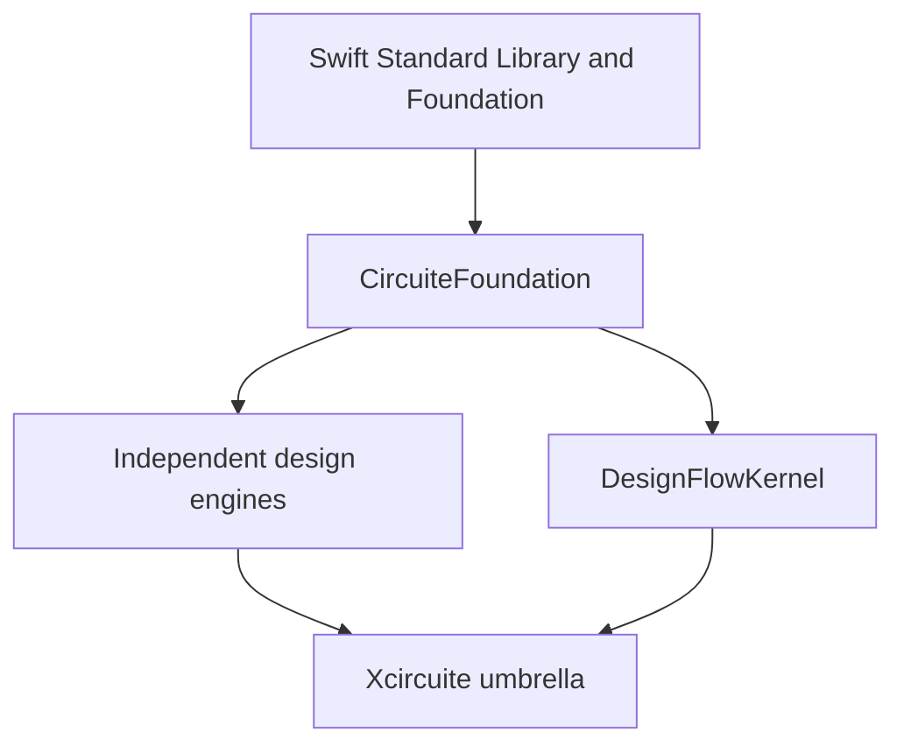

# CircuiteFoundation

`CircuiteFoundation` is the dependency floor shared by independently usable circuit-design engines.
It defines stable cross-domain vocabulary without owning a design flow, a project model, or any domain algorithm.



## What belongs here

| Area | Public surface |
|---|---|
| Engine execution | Minimal `Engine` protocol |
| Artifact trust | Location, identity, format, digest, reference, verification |
| Evidence | Execution provenance and evidence manifest |
| Diagnostics | Stable severity, code, subject, and suggested action |
| Design addressing | Hierarchical design-object references |
| Physical representation | Database-unit scale and electrical quantities absent from Foundation |
| Schema evolution | Comparable semantic `SchemaVersion` |

Domain results remain in their owning packages. A timing engine owns timing paths, a DRC engine owns violations,
and a PDK package owns process rules. Xcircuite owns composition and orchestration.

## Usage

```swift
import CircuiteFoundation

struct SimulationEngine: Engine {
    func execute(_ request: SimulationRequest) async throws -> SimulationOutput {
        // Domain implementation
    }
}
```

See `DESIGN.md` for the admission criteria and dependency rules, `REQUIREMENTS.md` for the implementation
contract, and `GOAL_STATUS.md` for the current completion state.
