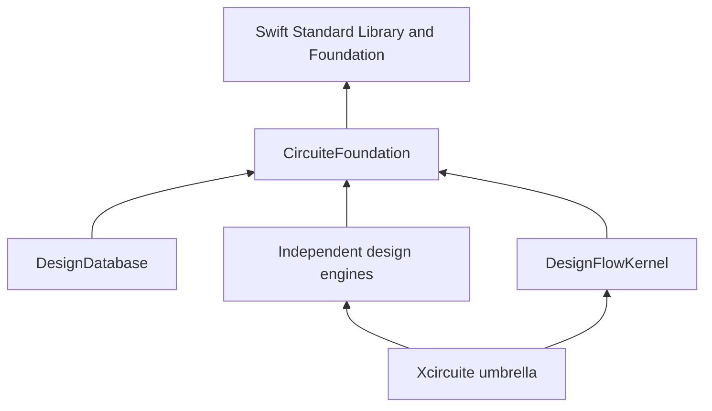

# CircuiteFoundation

`CircuiteFoundation` is the dependency floor shared by independently usable circuit-design engines,
`DesignDatabase`, external services, and Xcircuite composition. It defines stable cross-domain values and contracts
without owning database storage, a design flow, a project model, or any domain algorithm.


```mermaid
flowchart BT
  Swift["Swift Standard Library and Foundation"]
  Common["CircuiteFoundation"]
  Database["DesignDatabase"]
  Engines["Independent design engines"]
  Flow["DesignFlowKernel"]
  Umbrella["Xcircuite umbrella"]

  Common --> Swift
  Database --> Common
  Engines --> Common
  Flow --> Common
  Umbrella --> Engines
  Umbrella --> Flow
```

Arrows represent compile-time dependency from consumer to dependency.

## What belongs here

| Area | Public surface |
|---|---|
| Engine execution | Minimal `Engine` protocol |
| Artifact trust | Content-derived identity, semantic descriptor, separate availability, bounded access intent, digest, verification |
| Evidence | Invocation, environment fingerprint, execution provenance, and evidence manifest |
| Diagnostics | Stable severity, code, subject, and suggested action |
| Design addressing | Database, revision, entity, opaque authorization-subject scope, path, external-object references |
| Physical representation | Database-unit scale and electrical quantities absent from Foundation |
| Compatibility | Schema version ranges and capability negotiation values |

Domain results remain in their owning packages. A timing engine owns timing paths, a DRC engine owns violations,
and a PDK package owns process rules. `DesignDatabase` owns canonical design revision,
mutation, and semantic query contracts; the fixed database framework owns generic
persistence/transaction/query execution. Xcircuite owns composition and orchestration.
The opaque authorization-subject scope is a value only. Authentication, grant issuance,
principal mapping, and access decisions remain outside CircuiteFoundation.

Artifact roles are open validated tokens. A content-derived artifact reference carries its semantic descriptor,
while local/service availability carries the locator independently. In-process and external-process invocations share one typed
provenance model without persisting raw environment variables or secrets.
Evidence manifests carry an explicit schema version; missing schema metadata is
rejected rather than inferred.

## Usage

```swift
import CircuiteFoundation

struct SimulationEngine: Engine {
    func execute(_ request: SimulationRequest) async throws -> SimulationOutput {
        // Domain implementation
    }
}
```

The database-facing identity, exact reference, schema range, capability negotiation, typed diagnostic subject,
and typed provenance revision contracts are implemented as an intentionally breaking API. The target architecture
separates Standard-Library-only Core, optional Foundation conversions, Crypto, and secure root-capability
FileSystem products. Host serialization is an explicit adapter re-exported by the Foundation product; Core does
not expose `Codable`, `Encoder`, or `Decoder`. The target split, closure-scoped incremental digest contract,
same-handle no-follow file verification, and location-independent bounded artifact access are executable surfaces.
The Core probes compile, link, and produce byte-identical Native/WASI/Embedded runtime output. The separate host
serialization probe is byte-identical on Native/WASI and excluded from Embedded. Crypto is verified on Native and
returns typed unsupported on the pinned WASI profiles; secure FileSystem is a Native Darwin adapter with an executed
security corpus. See `PORTABILITY_MATRIX.md`, `DESIGN.md`, `REQUIREMENTS.md`, and `GOAL_STATUS.md` for the exact boundary.
